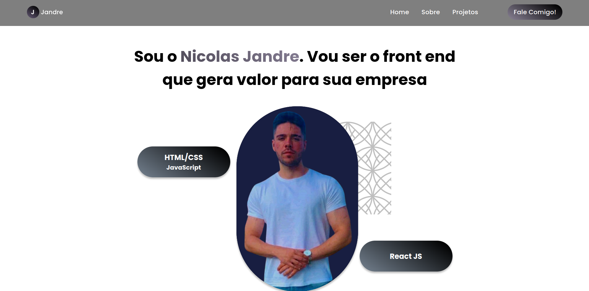

<h1 align="center">Portfolio (não em uso)</h1>

Este é o meu primeiro portfolio feito. Não o uso mais, mas é uma lembrança de um de meus primeiros projetos.

 

Tecnologias utilizadas:
 HTML e CSS
 Javascript
 UI/UX Design
 Git e GitHub

